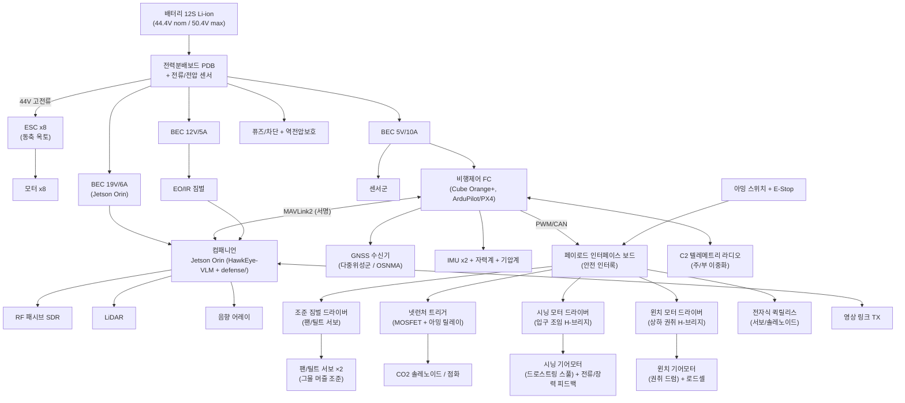

# ⚡ 06. 내부 회로 설계 (Electrical / Avionics Architecture)

> 그물매 모선드론의 **전기/전자 아키텍처** — 전력분배, 비행제어, 컴패니언 컴퓨트,
> 센서, **넷런처 트리거 / 윈치 / 퀵릴리스 페이로드 회로**, 통신, 안전 인터록.
> **바로 제작 가능한 작동설계** 수준까지 포함한다 — 실제 부품번호 BOM(§8), 와이어/퓨즈 사이징(§9),
> FC·페이로드 보드 핀아웃/결선(§10), 전원투입·아밍·발사·회수·투하·페일세이프 작동 시퀀스와 타이밍(§11).
> 남은 건 KiCad 회로도 캡처/거버뿐(§12).

설계 원칙 3줄:
1. **안전 우선** — 페이로드(넷런처/릴리스)는 다중 인터록 없이는 절대 동작 안 함.
2. **분리(isolation)** — 추진 고전류 버스와 항공전자 저전류 버스를 물리/전기적으로 분리.
3. **방어 연계** — FC↔컴패니언 MAVLink 링크는 [`defense/link/mavlink_signing.py`](../defense/link/mavlink_signing.py)로 서명.

---

## 1. 시스템 블록 다이어그램



---

## 2. 전력 아키텍처

### 2.1 버스 구성
| 버스 | 전압 | 소스 | 부하 |
|------|------|------|------|
| 추진 버스 | 44.4V (12S) | 배터리→PDB | ESC x8 |
| 항전 5V | 5V / 10A | BEC #1 (이중화) | FC, GNSS, IMU, 저전력 센서 |
| 페이로드 12V | 12V / 5A | BEC #2 | EO/IR 짐벌, LiDAR, 윈치 로직 |
| 컴퓨트 19V | 19V / 6A | BEC #3 | Jetson Orin, SDR |

- **이중화 BEC**: 5V 항전 버스는 BEC 2개 다이오드 OR-ing → 단일 BEC 고장에도 FC 생존.
- **역전압/인러시 보호**: PDB 입력에 이상적 다이오드(ideal-diode) + 프리차지 회로.
- **전류/전압 센싱**: PDB 내장 홀센서 → FC로 배터리 텔레메트리(셀 전압은 BMS에서 별도).

### 2.2 전력 예산 (MTOW 14 kg 호버 기준)
| 서브시스템 | 전압 | 전류(연속) | 전력 | 비고 |
|------------|------|-----------|------|------|
| 추진 8모터 (호버) | 44V | ~82 A | ~3,600 W | 최대 추력 시 ~9 kW 피크 |
| Jetson Orin | 19V | ~2.1 A | ~40 W | VLM 추론 부하 시 ↑ |
| FC + IMU + GNSS | 5V | ~3 A | ~15 W | |
| EO/IR 짐벌 | 12V | ~2.5 A | ~30 W | |
| LiDAR | 12V | ~0.8 A | ~10 W | |
| RF SDR + 음향 | 19V/5V | — | ~15 W | |
| 통신(C2 + 영상TX) | 5V/12V | — | ~25 W | |
| 페이로드 로직 대기 | 12V | ~0.4 A | ~5 W | 트리거/윈치 대기 |
| **항전+페이로드 소계** | | | **~140 W** | |
| **호버 총합** | | | **≈ 3.74 kW** | |

> 페이로드 동작은 **간헐(transient)**: 윈치 피크 ~300 W(<수 초), 넷런처 트리거 ~100 W(<1 초).
> 이들은 전용 캡(슈퍼캡/대용량 캐패시터)으로 공급해 추진 버스 새깅 방지.

**지구력**(참조: [docs/01](01_드론_스펙.md) 25–42분): 12S ~30Ah(≈1.33 kWh) 가용에서
MTOW 호버 ≈ 20분, 경량/순항 ≈ 35분. → 사양 범위와 정합.

---

## 3. 비행제어 + 컴퓨트

| 항목 | 선정(후보) | 역할 |
|------|-----------|------|
| FC | Cube Orange+ (STM32H7, 삼중 IMU) | 자세/항법/추진 믹싱, 페일세이프 |
| 펌웨어 | ArduPilot 또는 PX4 | EKF3 + GPS glitch/innovation gating(방어 연계) |
| 컴패니언 | NVIDIA Jetson Orin NX/AGX | HawkEye-VLM 추론, `defense/monitor.py`, 미션로직 |
| 링크 | FC ↔ Orin = UART/Ethernet, **MAVLink2 서명** | 명령 위조/주입 차단 |

> FC의 EKF GPS 게이팅과 컴패니언의 `defense/gnss/*`(OSNMA/RAIM/일관성)는 **다층**으로 동작.
> 항법 신뢰 판정 결과(TRUST/DEGRADED/DEADRECKON/RTH)는 Orin→FC로 모드 권고.

---

## 4. 센서 인터페이스

| 센서 | 버스/IF | 연결 |
|------|---------|------|
| GNSS (다중위성군, OSNMA 대응) | UART + I2C(컴퍼스) | FC |
| IMU x2 + 기압계 | FC 내장(SPI) | FC |
| EO/IR 짐벌 | CAN/PWM + HDMI/CSI 영상 | FC(제어) + Orin(영상) |
| LiDAR (고도/근접) | UART/CAN | FC + Orin |
| RF 패시브 SDR | USB3 | Orin |
| 음향 어레이 | I2S/USB | Orin |

---

## 5. 페이로드 회로 — **안전 인터록이 핵심**

### 5.1 넷런처 트리거 (CO2/점화)
```
아밍 조건 = (하드웨어 아밍 스위치 ON)
           AND (FC 비행중·고도>Hmin)
           AND (소프트웨어 ARM 명령, 서명된 MAVLink)
           AND (E-Stop NOT pressed)
```
- 트리거는 **로우사이드 N-ch MOSFET** + 직렬 **아밍 릴레이**(기계적 차단)로 이중화.
- 아밍 안 되면 게이트 드라이브 자체가 물리적으로 끊김(릴레이 오픈) → SW 버그로도 오발 불가.
- 트리거 펄스는 FC가 모니터링(전류 확인)하여 발사 성공/실패 텔레메트리 생성.

### 5.1b 그물 조준 짐벌 — **소프트웨어 조준 (팬/틸트 서보)**
그물을 **중력 낙하**가 아니라 **명령한 방향으로 발사**하기 위한 팬/틸트 조준 장치.
(SCAD `net_launcher()` 와 1:1 대응.)
- **구성:** 고토크 디지털 서보 **2개**(팬=좌우, 틸트=앞뒤). 머즐(런처 헤드)을 짐벌에 얹어 조준.
- **제어:** 페이로드 IF 보드의 **PWM 2채널**(50~333Hz). GCS(지상조종 앱)의 키보드 입력 →
  서명 명령 → FC → 페이로드 IF → 서보. 발사 **전에** 조준 완료(아래 §11.3).
- **피드백:** 디지털 서보 내장 위치 + (옵션)포텐쇼미터로 실제 조준각 텔레메트리.
- **전원/안전:** 서보 전원은 **6V BEC**(FC 로직과 분리). 아밍과 무관하게 조준은 가능하되,
  **발사(FIRE)는 아밍+조준완료 인터록** 하에서만. 서보 스톨 시 토크 제한.

### 5.2 입구 조임(Cinch) 모터 — **전용 구동장치 (윈치와 별개)**
포획 성공 직후 그물 **입구(mouth)** 를 졸라 닫는 **전용 액추에이터**. 윈치(상하 권취)와
물리적으로 분리된 별도 모터·드라이버다. (SCAD `cinch_mechanism()` 와 1:1 대응.)
- **구성:** 소형 브러시 기어모터 + **H-브리지 드라이버**(윈치와 동급) + 플랜지 **드로스트링 스풀(드럼)**.
- **동작:** 스풀이 림 둘레 드로스트링(퍼스라인)을 감음 → mouth 입구 둘레가 졸려 포획물 이탈 방지.
- **피드백:** 모터 전류 센싱(INA226) + 스풀축 장력/위치 피드백(로드셀 또는 엔코더).
  **장력/전류 임계 도달 = 결속 완료** → 자동 정지(스톨 보호 겸).
- **인터록:** 시닝 모터도 넷런처와 **동일 아밍/E-Stop 인터록** 하에서만 구동. 과전류 시 즉시 정지.

### 5.3 윈치 (상하 권취 — 회수/운반)
- 브러시드 윈치 기어모터 + **H-브리지 드라이버**, 장력 센서(로드셀) 피드백.
- 시닝으로 입구가 결속된 **다음 단계**: 그물 포켓째 벨리 근처로 끌어올려 안정화·운반.
- 과장력/엉킴 시 자동 정지(전류·장력 임계).

### 5.4 전자식 퀵릴리스 (투하/비상 분리)
- 서보 또는 래칭 솔레노이드. **투하는 발사와 분리된 별도 아밍 채널** + 지오펜스(인구밀집지역 금지) 확인 후만.
- 페일세이프: 통신두절 시 기본동작은 **유지(hold)**, 절대 자동 투하 안 함.

---

## 6. 통신 / 안전

| 계통 | 구성 |
|------|------|
| C2 텔레메트리 | 주(예: 2.4/5.8G 또는 전용대역) + 부(이중화), **MAVLink2 서명 필수** |
| 영상 링크 | Orin → 지상국, 별도 TX |
| 안전장치 | 하드웨어 아밍 스위치, E-Stop, 퓨즈/차단기, 추진버스 분리 커넥터(XT/AS150) |
| 그라운딩/EMI | 스타 그라운드, 추진 고전류 리턴과 신호 GND 분리, SDR/짐벌 차폐 |

---

## 7. 커넥션(요약) 표

| From | To | 신호/전력 | 커넥터 |
|------|----|-----------|--------|
| 배터리 | PDB | 12S 추진 | AS150 + XT90-S(프리차지) |
| PDB | ESC x8 | 44V | 6mm 불릿 |
| PDB | BEC x3 | 44V→5/12/19V | XT30 |
| FC | ESC | PWM/DShot/CAN | JST-GH |
| FC | Orin | MAVLink2(UART/Eth) | JST-GH/RJ45 |
| FC | 페이로드 IF 보드 | PWM/CAN + 아밍 | JST-GH |
| 아밍 스위치/E-Stop | 페이로드 IF 보드 | 디지털 인터록 | 방수 스위치 |

---

## 8. 제작용 부품표 (BOM — 실제 부품번호 기준)

> 전부 **상용 검증 부품**으로 구성 — 받아서 그대로 조립 가능. (대체 부품 1개는 괄호로 병기)

| 블록 | 부품 (예시 실제 부품번호) | 핵심 사양 | 수량 |
|------|--------------------------|-----------|:----:|
| 비행제어 | **CubePilot Cube Orange+** (STM32H757, 삼중 IMU) + 표준 캐리어보드 | DShot/CAN/다중 UART | 1 |
| GNSS(주) | **Septentrio mosaic-X5** (Galileo **OSNMA** 지원) | 다중위성군, RTK, 인증항법 | 1 |
| GNSS/컴퍼스(부) | **Here3+** (DroneCAN) | 2nd GNSS + 자력계 이중화 | 1 |
| 컴패니언 | **NVIDIA Jetson AGX Orin** 모듈 + 캐리어 | 입력 9–20V, ~60W, VLM 추론 | 1 |
| 모터 | **T-Motor U8II KV150** (대안: MN605-S KV170) | 18″ 프롭용 저KV·고토크 | 8 |
| 프로펠러 | **T-Motor 18×6.1 카본 폴딩** | 동축반전 | 8 |
| ESC | **T-Motor FLAME 80A 12S HV** | DShot600 + 텔레메트리 | 8 |
| 배터리 | **12S6P Li-ion 22Ah** (Molicel P42A) + 스마트 BMS 200A | 44.4V nom / 50.4V max | 1 |
| 전력모듈/PDB | **Mauch HS-200-HV** 홀센서 + Power Cube 분배 | 12S, 200A 연속 측정 | 1 |
| BEC 5V(이중화) | **Mauch 5.3V/8A BEC** ×2 (다이오드 OR-ing) | 항전 버스 | 2 |
| BEC 12V | DC-DC 강압 (예: **CUI PYB20-Q24-S12**) | 12V/5A | 1 |
| BEC 19V | DC-DC 19V/100W (Jetson 전용) | 19V/6A | 1 |
| 페이로드 IF MCU | **STM32G474** 보드 (or 커스텀) | TIM PWM, ADC, 다중 GPIO | 1 |
| 넷런처 밸브 | **12V NC 공압 솔레노이드 밸브** (1/4″, ~8W) | CO₂ 1발 방출 | 2 |
| 트리거 MOSFET | **Infineon IRLB3034PBF** (40V, 로직레벨) | 로우사이드 스위칭 | 2 |
| 아밍 릴레이 | **Omron G8P-1A4P** (밀폐형 SPST, 30A) | 게이트/전원 물리 차단 | 1 |
| 윈치 모터 | 12V 브러시 기어모터 (예: **Pololu 37D 메탈기어**) | 상하 권취 | 1 |
| 윈치 드라이버 | **Pololu G2 High-Power 24v21** (or VNH5019) | H-브리지, 전류감지 | 1 |
| 윈치 장력 센서 | 5kg **로드셀 + HX711** ADC | 권취 장력 피드백 | 1 |
| **시닝 모터** (입구 조임) | 12V 소형 브러시 기어모터 (예: **Pololu 25D HP 메탈기어**) | 드로스트링 스풀 권취 | 1 |
| **시닝 드라이버** | **Pololu G2 24v13** (or DRV8871) | H-브리지, 전류감지 | 1 |
| 시닝 전류/장력 | **INA226** 전류센서 (+ 옵션 엔코더/로드셀) | 결속 임계 판정 | 1 |
| **조준 서보** (팬/틸트) | 고토크 디지털 서보 **Savöx SB-2290SG** (20kg급) | 그물 머즐 조준 | 2 |
| **서보 BEC** | 6V/5A UBEC (서보 전원, 로직 분리) | 조준 서보 전원 | 1 |
| 퀵릴리스 | 고토크 메탈기어 서보 **Savöx SB-2290SG** (or 래칭 솔레노이드) | 투하/비상 분리 | 1 |
| C2 라디오(주) | **RFD900x** (900MHz, MAVLink) | 장거리 텔레메트리 | 1 |
| C2 라디오(부) | **Microhard pMDDL2450** (or Doodle Labs) | 이중화 메시 | 1 |
| 영상 링크 | **Herelink HD** (or 디지털 VTX) | 영상 + 백업 C2 | 1 |
| 안전장치 | 방수 아밍 토글 + **비상정지(E-Stop) 버튼** | HW 인터록 | 각 1 |
| 메인 보호 | **150A ANL 퓨즈** + 홀더 | BMS 컷오프 백업 | 1 |

---

## 9. 와이어 게이지 / 퓨즈 사이징

> 기준 ampacity는 **chassis wiring(번들/단거리)** 기준 실리콘 와이어. 연속전류 + 마진으로 게이지 선정.

| 구간 | 연속전류 | 피크 | 와이어(실리콘) | 보호 |
|------|:-------:|:----:|:--------------:|------|
| 배터리 → PDB (메인) | ~82 A | ~200 A (<1s) | **4 AWG** (~135A) | 12S BMS 200A 컷오프 + **150A ANL** 백업 |
| PDB → ESC ×8 | ~10 A/ch | ~25 A/ch | **12 AWG** (~41A) | ESC 내장 + 6mm 불릿 |
| PDB → BEC 입력(44V) | <3 A | — | **18 AWG** | 5A |
| 5V 항전 버스 | ~10 A | — | **14 AWG** (~32A) | PTC/5A 분기 |
| 12V 페이로드 | ~5 A | ~10 A | **16 AWG** (~22A) | 7.5A |
| 19V 컴퓨트(Jetson) | ~6 A | — | **16 AWG** | 7.5A |
| 넷런처 솔레노이드 | ~2 A | ~4 A(인러시) | **18 AWG** (~16A) | 5A + 아밍 릴레이 하류 |
| 윈치 (상하 권취) | ~5 A | ~10 A(스톨 제한) | **16 AWG** | 10A |
| 시닝 모터 (입구 조임) | ~2.5 A | ~6 A(스톨 제한) | **18 AWG** (~16A) | 7.5A + 아밍 릴레이 하류 |
| 조준 서보 ×2 (6V BEC) | ~2 A | ~7 A(2서보 스톨) | **18 AWG** | 8A (BEC 측) |
| 릴리스 서보 | ~1.5 A | ~3 A | **20 AWG** | 3A |

**참조 ampacity(AWG, chassis):** 4≈135A · 6≈101A · 8≈73A · 10≈55A · 12≈41A · 14≈32A · 16≈22A · 18≈16A · 20≈11A.

- 솔레노이드/릴레이/윈치·시닝 모터 코일은 전부 **플라이백 다이오드**(예: 1N5408 / 쇼트키 SS34) 병렬.
- 메인 입력 인러시는 **XT90-S(프리차지 저항 내장)** 후 AS150 체결 순서로 제한.

---

## 10. 핀아웃 / 결선 상세

### 10.1 FC(Cube Orange+) 포트 맵
| FC 포트 | 연결 대상 | 프로토콜 / 속도 |
|---------|-----------|-----------------|
| POWER1 | Mauch HS-200 전류센서 | I2C 전력 모니터 |
| POWER2 | 보조 전원 모듈(이중화) | I2C |
| MAIN OUT 1–8 | ESC 1–8 | **DShot600** |
| GPS1 | Septentrio mosaic-X5 | UART + I2C(컴퍼스) |
| CAN1 | Here3+ (2nd GNSS) | DroneCAN |
| CAN2 | EO/IR 짐벌 | DroneCAN |
| TELEM1 | RFD900x (주 C2) | **MAVLink2 서명** 57600 |
| TELEM2 | Jetson AGX Orin | **MAVLink2 서명** (UART/Eth) |
| AUX OUT 1 | 페이로드 IF: **ARM-PERMIT** | GPIO (비행중·고도 인터록) |
| AUX OUT 2 | 페이로드 IF: **FIRE-CMD** | PWM/GPIO 펄스 |
| AUX OUT 3 | 페이로드 IF: **WINCH-CMD** (상하 권취) | PWM |
| AUX OUT 4 | 페이로드 IF: **RELEASE-ARM**(별도 채널) | GPIO |
| AUX OUT 5 | 페이로드 IF: **CINCH-CMD** (입구 조임) | PWM |
| AUX OUT 6 | 페이로드 IF: **AIM-PAN** (그물 조준 좌우) | PWM(서보) |
| 또는 FC 서보레일 | **AIM-TILT** (그물 조준 앞뒤) — IF 보드 직결 | PWM(서보) |

> **단일 진실원천:** 그물 조준/페이로드 서보의 **채널·PWM·각도리밋**은 소프트웨어
> [`gcs/payload_map.py`](../gcs/payload_map.py)에서 정의된다(ArduPilot **SERVO9**=AIM-PAN,
> **SERVO10**=AIM-TILT, **SERVO11**=CINCH, **SERVO12**=RELEASE, **RELAY0**=NET FIRE).
> 콕핏이 그 채널로 `DO_SET_SERVO`/`DO_SET_RELAY`를 보내고, SCAD `net_pan/net_tilt`
> 리밋(−60..60 / 0..75)도 동일 값을 쓴다. 배포·캘리브레이션은 [docs/11](11_CONOPS_and_Deployment.md).

### 10.2 페이로드 인터페이스 보드 (STM32G474) 핀맵
| 핀 | 방향 | 신호 |
|----|:----:|------|
| PA0 | IN | HW 아밍 스위치 (풀다운, ON=3.3V) |
| PA1 | IN | **E-Stop** (NC, 눌림=LOW=즉시정지) |
| PA2 | IN | FC **ARM-PERMIT** (AUX OUT1) |
| PA3 | IN | FC **FIRE-CMD** (AUX OUT2) |
| PA4 | IN | FC **RELEASE-ARM** (AUX OUT4) |
| PB0 / PB1 | IN | 윈치 로드셀 HX711 (SCK / DOUT) |
| PB6 / PB7 | I2C | 전류센서 INA226 ×N (솔레노이드 0x40 / 시닝 0x41, 션트) |
| PB10 | OUT | **아밍 릴레이** 코일 (게이트드라이버 + 플라이백) |
| PB11 | OUT | **솔레노이드 MOSFET 게이트** (IRLB3034, 로우사이드) |
| PA8 (TIM1_CH1) | OUT | 윈치 드라이버 PWM (상하 권취) |
| PA9 | OUT | 윈치 방향(DIR) |
| PA10 (TIM1_CH3) | OUT | 릴리스 서보 PWM (50Hz) |
| PA11 (TIM1_CH4) | OUT | **시닝 드라이버 PWM** (입구 조임) |
| PA12 | OUT | **시닝 방향(DIR)** |
| PA6 (TIM3_CH1) | OUT | **AIM-PAN 서보 PWM** (그물 조준 좌우) |
| PA7 (TIM3_CH2) | OUT | **AIM-TILT 서보 PWM** (그물 조준 앞뒤) |
| PB4 | IN | 시닝 스풀 엔코더(옵션, 위치 피드백) |

> **부팅 안전 보장:** MCU 리셋 시 모든 출력 LOW + 아밍 릴레이 OPEN(외부 풀다운). 솔레노이드 전원은
> **아밍 릴레이 하류**에서만 공급되므로, 릴레이 오픈이면 게이트가 켜져도 물리적으로 전류 0.

---

## 11. 작동 시퀀스 & 타이밍

### 11.1 전원투입 (Power-up)
1. 메인 배터리 체결 → **XT90-S 프리차지**(인러시 제한, ~1s) → AS150 메인 체결.
2. BMS 셀밸런스/전압 확인 → PDB 전류센서 오프셋 캘리브레이션.
3. BEC 순차 기동(**5V FC 우선**) → FC 부팅(NuttX) ~3s.
4. 페이로드 IF MCU 부팅 → **모든 출력 LOW, 아밍 릴레이 OPEN**(기본 SAFE).
5. Jetson Orin 부팅(~30s) → `defense/monitor.py` + EO/IR 영상 파이프라인(GCS 텔레옵용). VLM 자율판단은 제거됨(수동 텔레옵).
6. FC↔Orin **MAVLink2 서명 핸드셰이크**(키 일치 확인). 불일치 시 명령 전면 거부.

### 11.2 페이로드 아밍 상태머신 (디바운스 타이밍 포함)
```
SAFE ──(HW 아밍 ON ∧ ¬E-Stop)──▶ ARMED_HW ──(FC ARM-PERMIT ∧ 서명 SW ARM)──▶ ARMED_FULL
  ▲                                                                              │
  └────────────── 조건 1개라도 해제되면 즉시 복귀 (릴레이 OPEN < 20ms) ◀── (≥200ms 안정) ──▶ FIRE_WINDOW
```
| 상태 | 조건 | 릴레이 | 솔레노이드 / 모터 전원 |
|------|------|:------:|:----------------:|
| SAFE | 기본 | OPEN | 없음 |
| ARMED_HW | HW 아밍 ON ∧ ¬E-Stop | CLOSE(50ms 정착) | 대기 |
| ARMED_FULL | + 비행중 ∧ 고도>Hmin ∧ 서명 SW ARM | CLOSE | 인가 |
| FIRE_WINDOW | 위 조건 ≥200ms 연속(채터링 방지) | CLOSE | 인가 |

> 넷런처 솔레노이드뿐 아니라 **시닝 모터·윈치 모터 전원도 아밍 릴레이 하류**에 둔다.
> 릴레이 OPEN(SAFE/E-Stop)이면 게이트/PWM이 켜져도 입구 조임·권취 모터는 물리적으로 전류 0.

### 11.3a 조준 (AIM) — 발사 전 필수
1. GCS 오퍼레이터 키보드 입력 → **AIM-PAN/AIM-TILT** 서명 명령 → 페이로드 IF가 서보 PWM 갱신.
2. 서보 위치(또는 포텐쇼) 텔레메트리로 **조준각 도달** 확인 → `AIM_READY` 플래그.
3. 조준은 아밍과 무관하게 가능(서보 BEC 전원). 단 **FIRE는 `AIM_READY` ∧ `FIRE_WINDOW`** 필요.

### 11.3b 발사 (FIRE)
1. `FIRE_WINDOW` ∧ `AIM_READY` 에서 FC **FIRE-CMD** 수신.
2. MCU: 솔레노이드 MOSFET 게이트 ON → **펄스 150ms**(CO₂ 1발) — **조준된 방향으로** 그물 사출.
3. INA226로 펄스 중 전류 측정 → 정상=**발사확인**, 무전류=**불발** 텔레메트리.
4. 게이트 OFF 후 **200ms 쿨다운**(중복발사 방지). 재발사는 재아밍 필요.

### 11.4 입구 조임 (Cinch) — **1단계: 전용 모터로 mouth 결속**
> 발사확인 직후 **자동**으로 입구부터 졸라 닫는다. 윈치(상하 권취)는 그 *다음* 단계.
1. `FIRE_WINDOW`에서 발사확인 수신 → **아밍/E-Stop 인터록 유지 확인**.
2. 시닝 드라이버 PWM↑ → 드로스트링 스풀 권취 시작(입구 둘레 퍼스라인 당김).
3. INA226 모터전류 / 스풀 장력 모니터: **장력 ≥ ~5kg(또는 전류 임계) 도달 = 입구 결속 완료** → **자동 정지**.
4. 결속 후 홀드 토크 유지(역전 방지). 미달 시 타임아웃(예: 6s) 또는 재시도 1회 후 경보.
5. 안전: **과전류 >6A 0.5s** 또는 E-Stop/아밍 해제 → 즉시 정지(스톨 보호).

### 11.5 윈치 회수 (Hoist) — **2단계: 상하 권취로 벨리 안정화**
> 입구가 결속된 뒤에만 진입(시닝 완료 플래그가 게이트).
1. 윈치 PWM↑(상하 권취), 로드셀 장력 모니터.
2. 그물 포켓을 벨리 근처까지 끌어올린 뒤 정지(홀드 토크 유지) → 그물째 운반.
3. **과장력 >15kg** 또는 **스톨전류 >10A 0.5s** → 자동 정지 + 경보.

### 11.6 투하 (Release) — 가장 보수적
1. **RELEASE-ARM 채널(AUX OUT4) HIGH** 필요 (발사 채널과 물리 분리).
2. 지오펜스 인구밀집 금지구역 클리어 + EO/IR 지상 무인 확인 + **인간 승인 토큰(서명)**.
3. 모두 충족 시 릴리스 서보 개방(or 래칭 솔레노이드 **80ms** 펄스).
4. 투하 후 모선 수평 이격(파편 회피) → 서보 원위치.

### 11.7 페일세이프 타이밍
| 트리거 | 시간 | 동작 |
|--------|:----:|------|
| C2 링크 두절 | t>2s | **HOLD**(현 위치/고도), 페이로드 동작 전면 금지 |
| C2 링크 두절 | t>10s | **RTL**(자동귀환). 매달린 그물 **유지**, 자동 투하 절대 금지 |
| E-Stop 누름 | <20ms | 모든 페이로드 출력 차단(릴레이 OPEN), 비행은 FC 정책 |
| 배터리 임계 | 셀<3.4V or RTL예약 | 자동 RTL |
| 방어 판정 DEADRECKON/스푸핑 의심 | 즉시 | 관성항법 전환 + RTH 권고(Orin→FC), **발사 보류** |

---

## 12. 다음 단계
- [ ] §8 BOM 기반 **KiCad 회로도 캡처** → PDB / 페이로드 IF 보드 거버 출력.
- [ ] §9·§10 기반 **하네스 도면**(와이어 길이/커넥터 압착 BOM) 확정.
- [ ] 벤치에서 §11 시퀀스 **HIL 검증**(릴레이 정착·발사펄스·E-Stop <20ms 계측).
- [ ] 전력 예산 실측 검증(벤치 + 호버 텔레메트리).
- [ ] 인터록 FMEA(고장모드 영향분석) — 페이로드 오동작 0 목표

> 한 줄: **고전류는 분리하고, 페이로드는 인터록으로 잠그고, 명령 링크는 서명한다.**
