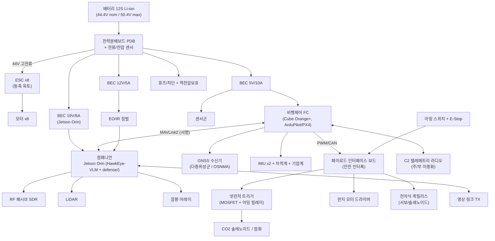

# ⚡ 06. 내부 회로 설계 (Electrical / Avionics Architecture)

> 그물매 모선드론의 **전기/전자 아키텍처** — 전력분배, 비행제어, 컴패니언 컴퓨트,
> 센서, **넷런처 트리거 / 윈치 / 퀵릴리스 페이로드 회로**, 통신, 안전 인터록.
> 실제 PCB/하네스 상세설계 전 단계의 **시스템 회로 설계**다. (실제 거버/네틀리스트는 다음 단계)

설계 원칙 3줄:
1. **안전 우선** — 페이로드(넷런처/릴리스)는 다중 인터록 없이는 절대 동작 안 함.
2. **분리(isolation)** — 추진 고전류 버스와 항공전자 저전류 버스를 물리/전기적으로 분리.
3. **방어 연계** — FC↔컴패니언 MAVLink 링크는 [`defense/link/mavlink_signing.py`](../defense/link/mavlink_signing.py)로 서명.

---

## 1. 시스템 블록 다이어그램



---

## 2. 전력 아키텍처

### 2.1 버스 구성
| 버스 | 전압 | 소스 | 부하 |
|------|------|------|------|
| 추진 버스 | 44.4V (12S) | 배터리→PDB | ESC x8 |
| 항전 5V | 5V / 10A | BEC #1 (이중화) | FC, GNSS, IMU, 저전력 센서 |
| 페이로드 12V | 12V / 5A | BEC #2 | EO/IR 짐벌, LiDAR, 윈치 로직 |
| 컴퓨트 19V | 19V / 6A | BEC #3 | Jetson Orin, SDR |

- **이중화 BEC**: 5V 항전 버스는 BEC 2개 다이오드 OR-ing → 단일 BEC 고장에도 FC 생존.
- **역전압/인러시 보호**: PDB 입력에 이상적 다이오드(ideal-diode) + 프리차지 회로.
- **전류/전압 센싱**: PDB 내장 홀센서 → FC로 배터리 텔레메트리(셀 전압은 BMS에서 별도).

### 2.2 전력 예산 (MTOW 14 kg 호버 기준)
| 서브시스템 | 전압 | 전류(연속) | 전력 | 비고 |
|------------|------|-----------|------|------|
| 추진 8모터 (호버) | 44V | ~82 A | ~3,600 W | 최대 추력 시 ~9 kW 피크 |
| Jetson Orin | 19V | ~2.1 A | ~40 W | VLM 추론 부하 시 ↑ |
| FC + IMU + GNSS | 5V | ~3 A | ~15 W | |
| EO/IR 짐벌 | 12V | ~2.5 A | ~30 W | |
| LiDAR | 12V | ~0.8 A | ~10 W | |
| RF SDR + 음향 | 19V/5V | — | ~15 W | |
| 통신(C2 + 영상TX) | 5V/12V | — | ~25 W | |
| 페이로드 로직 대기 | 12V | ~0.4 A | ~5 W | 트리거/윈치 대기 |
| **항전+페이로드 소계** | | | **~140 W** | |
| **호버 총합** | | | **≈ 3.74 kW** | |

> 페이로드 동작은 **간헐(transient)**: 윈치 피크 ~300 W(<수 초), 넷런처 트리거 ~100 W(<1 초).
> 이들은 전용 캡(슈퍼캡/대용량 캐패시터)으로 공급해 추진 버스 새깅 방지.

**지구력**(참조: [docs/01](01_드론_스펙.md) 25–42분): 12S ~30Ah(≈1.33 kWh) 가용에서
MTOW 호버 ≈ 20분, 경량/순항 ≈ 35분. → 사양 범위와 정합.

---

## 3. 비행제어 + 컴퓨트

| 항목 | 선정(후보) | 역할 |
|------|-----------|------|
| FC | Cube Orange+ (STM32H7, 삼중 IMU) | 자세/항법/추진 믹싱, 페일세이프 |
| 펌웨어 | ArduPilot 또는 PX4 | EKF3 + GPS glitch/innovation gating(방어 연계) |
| 컴패니언 | NVIDIA Jetson Orin NX/AGX | HawkEye-VLM 추론, `defense/monitor.py`, 미션로직 |
| 링크 | FC ↔ Orin = UART/Ethernet, **MAVLink2 서명** | 명령 위조/주입 차단 |

> FC의 EKF GPS 게이팅과 컴패니언의 `defense/gnss/*`(OSNMA/RAIM/일관성)는 **다층**으로 동작.
> 항법 신뢰 판정 결과(TRUST/DEGRADED/DEADRECKON/RTH)는 Orin→FC로 모드 권고.

---

## 4. 센서 인터페이스

| 센서 | 버스/IF | 연결 |
|------|---------|------|
| GNSS (다중위성군, OSNMA 대응) | UART + I2C(컴퍼스) | FC |
| IMU x2 + 기압계 | FC 내장(SPI) | FC |
| EO/IR 짐벌 | CAN/PWM + HDMI/CSI 영상 | FC(제어) + Orin(영상) |
| LiDAR (고도/근접) | UART/CAN | FC + Orin |
| RF 패시브 SDR | USB3 | Orin |
| 음향 어레이 | I2S/USB | Orin |

---

## 5. 페이로드 회로 — **안전 인터록이 핵심**

### 5.1 넷런처 트리거 (CO2/점화)
```
아밍 조건 = (하드웨어 아밍 스위치 ON)
           AND (FC 비행중·고도>Hmin)
           AND (소프트웨어 ARM 명령, 서명된 MAVLink)
           AND (E-Stop NOT pressed)
```
- 트리거는 **로우사이드 N-ch MOSFET** + 직렬 **아밍 릴레이**(기계적 차단)로 이중화.
- 아밍 안 되면 게이트 드라이브 자체가 물리적으로 끊김(릴레이 오픈) → SW 버그로도 오발 불가.
- 트리거 펄스는 FC가 모니터링(전류 확인)하여 발사 성공/실패 텔레메트리 생성.

### 5.2 윈치 (회수 모드 줄 길이 제어)
- 브러시드/브러시리스 윈치 모터 + **H-브리지 드라이버**, 장력 센서(로드셀) 피드백.
- 과장력/엉킴 시 자동 정지(전류·장력 임계).

### 5.3 전자식 퀵릴리스 (투하 모드)
- 서보 또는 래칭 솔레노이드. **투하는 별도 아밍 채널** + 지오펜스(인구밀집지역 금지) 확인 후만.
- 페일세이프: 통신두절 시 기본동작은 **유지(hold)**, 절대 자동 투하 안 함.

---

## 6. 통신 / 안전

| 계통 | 구성 |
|------|------|
| C2 텔레메트리 | 주(예: 2.4/5.8G 또는 전용대역) + 부(이중화), **MAVLink2 서명 필수** |
| 영상 링크 | Orin → 지상국, 별도 TX |
| 안전장치 | 하드웨어 아밍 스위치, E-Stop, 퓨즈/차단기, 추진버스 분리 커넥터(XT/AS150) |
| 그라운딩/EMI | 스타 그라운드, 추진 고전류 리턴과 신호 GND 분리, SDR/짐벌 차폐 |

---

## 7. 커넥션(요약) 표

| From | To | 신호/전력 | 커넥터 |
|------|----|-----------|--------|
| 배터리 | PDB | 12S 추진 | AS150 + XT90-S(프리차지) |
| PDB | ESC x8 | 44V | 6mm 불릿 |
| PDB | BEC x3 | 44V→5/12/19V | XT30 |
| FC | ESC | PWM/DShot/CAN | JST-GH |
| FC | Orin | MAVLink2(UART/Eth) | JST-GH/RJ45 |
| FC | 페이로드 IF 보드 | PWM/CAN + 아밍 | JST-GH |
| 아밍 스위치/E-Stop | 페이로드 IF 보드 | 디지털 인터록 | 방수 스위치 |

---

## 8. 다음 단계
- [ ] PDB / 페이로드 인터페이스 보드 **회로도(KiCad)** + 거버
- [ ] 하네스 도면(와이어 게이지/길이/커넥터 BOM)
- [ ] 전력 예산 실측 검증(벤치 + 호버 텔레메트리)
- [ ] 인터록 FMEA(고장모드 영향분석) — 페이로드 오동작 0 목표

> 한 줄: **고전류는 분리하고, 페이로드는 인터록으로 잠그고, 명령 링크는 서명한다.**
