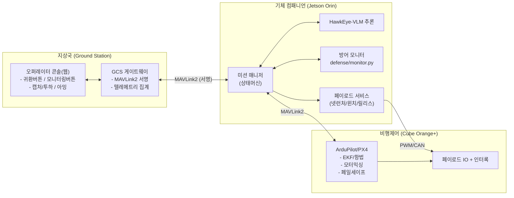
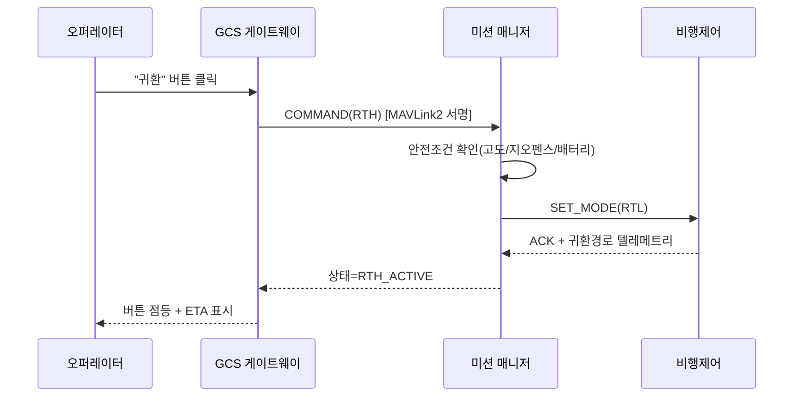
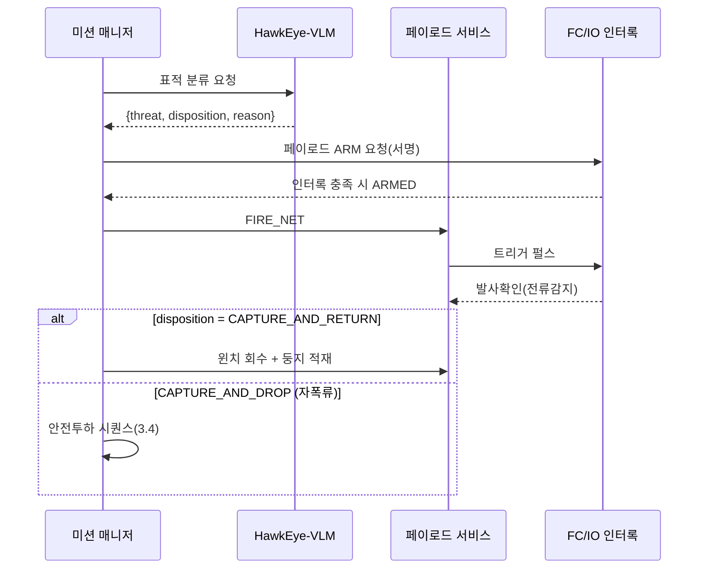
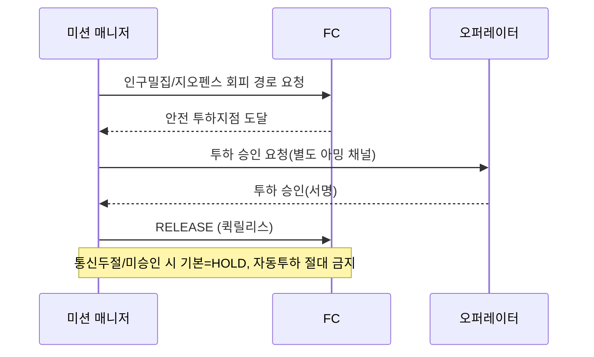

# 🖥️ 07. 소프트웨어 기획 (Hardware-Linked Software)

> **하드웨어 회로와 직접 연동되는 소프트웨어**의 아키텍처/플로우 기획.
> 핵심 컨트롤: **귀환 버튼(RTH)**, **모니터링 버튼/대시보드**, **캡처/투하 명령**, **안전 인터록**.
> ⚠️ 이 문서는 **기획 + 인터페이스 정의**다. 실제 구현 코드는 다음 단계
> (단, 방어 로직 `defense/`는 이미 구현·테스트 완료).

---

## 1. 3계층 소프트웨어 아키텍처



- **지상국**: 오퍼레이터 UI(버튼들) + 게이트웨이(모든 상향 명령을 **서명**).
- **컴패니언**: 미션 상태머신 + 인지(VLM) + 방어판정 + 페이로드 제어.
- **FC**: 저수준 비행/항법/페일세이프 + 페이로드 IO 인터록(회로 doc 06과 1:1 대응).

---

## 2. 하드웨어 ↔ 소프트웨어 매핑

| SW 컴포넌트 | 연동 하드웨어(doc 06) | 인터페이스 |
|-------------|----------------------|-----------|
| 미션 매니저 | FC | MAVLink2(서명) |
| 페이로드 서비스 | 넷런처 MOSFET/릴레이, 윈치 H-브리지, 퀵릴리스 | FC IO 보드 경유 PWM/CAN |
| 방어 모니터 | GNSS 수신기, C2 라디오 | FC 텔레메트리 + 링크 상태 |
| 인지(VLM) | EO/IR 짐벌, LiDAR, RF SDR | CSI/USB3/CAN |
| 모니터링 대시보드 | 전 계통 텔레메트리 | GCS 게이트웨이 집계 |

---

## 3. 핵심 컨트롤 & 메시지 플로우

### 3.1 귀환 버튼 (Return-To-Home)

- 서명 안 된 RTH 명령은 FC가 **거부**(`defense/link/mavlink_signing.py`).
- 방어 모니터가 `RETURN_TO_HOME` 권고 시 **자동 RTH** 트리거 가능(오퍼레이터에 통지).

### 3.2 모니터링 버튼 / 대시보드
- 토글 시 고빈도 텔레메트리 스트림 구독: 자세/위치/배터리/링크RSSI/**항법신뢰상태**/페이로드 상태.
- **방어 상태 위젯**: OSNMA 인증여부, RAIM 헬스, 스푸핑/재밍 플래그, C2 링크 신뢰 → `defense/monitor.py` 출력 그대로 표시.
- 영상(EO/IR) + VLM 판정 오버레이(threat_level / disposition / reason).

### 3.3 캡처 시퀀스 (그물 발사 → 회수/투하 결정)


### 3.4 안전 투하 (Safe-Drop) — 가장 보수적으로


---

## 4. 미션/안전 상태머신

```
IDLE → ARMED → PATROL → TRACK → INTERCEPT
                                  ├─ CAPTURE_RETURN → RECOVER → RTH
                                  └─ CAPTURE_DROP   → SAFE_TRANSIT → DROP → RTH
공통 전이: 어떤 상태에서든
   - 방어판정 DEADRECKON/RTH  → DEGRADED/RTH
   - E-Stop / 링크두절(페일세이프) → FAILSAFE(HOLD→RTL→LAND)
```

---

## 5. 인터페이스 정의 (스펙, 실구현 X)

> 명령 스키마(개념). 모든 상향 명령은 서명되고, 페이로드 명령은 인터록을 통과해야 한다.

```python
# 기획용 인터페이스 — 실제 구현 아님
class MissionCommand(Protocol):
    def return_to_home(self) -> Ack: ...           # 귀환 버튼
    def start_monitoring(self, rate_hz: int) -> Stream: ...  # 모니터링 버튼
    def fire_net(self, target_id: str) -> Ack: ...  # 인터록 필요
    def recover_winch(self) -> Ack: ...
    def safe_drop(self, approval_token: Signed) -> Ack: ...   # 별도 아밍 + 승인

class PayloadInterlock(Protocol):
    def is_armed(self) -> bool: ...
    # armed = HW 스위치 AND 비행중 AND 서명된 ARM AND not E-Stop  (doc 06 §5.1)
```

```typescript
// 대시보드 위젯 상태(개념)
interface NavSecurityWidget {
  mode: "TRUST_GNSS" | "GNSS_DEGRADED" | "DEADRECKON" | "RETURN_TO_HOME";
  osnmaAuthenticated: boolean;
  raimHealthy: boolean;
  spoofingSuspected: boolean;
  jammingSuspected: boolean;
  commandLinkTrusted: boolean;
}
```

---

## 6. 기술 스택(제안)
| 계층 | 후보 |
|------|------|
| 컴패니언 미들웨어 | ROS 2 (Humble) + micro-ROS 또는 MAVSDK/pymavlink |
| FC 펌웨어 | ArduPilot / PX4 (MAVLink2 서명 활성) |
| 지상국 UI | 웹(React) + WebSocket 텔레메트리, 또는 QGroundControl 확장 |
| 방어 모듈 | 본 레포 `defense/` (이미 구현, stdlib only) |
| 영상 | GStreamer (EO/IR → 대시보드) |

---

## 7. 안전 인터록 (소프트웨어 측)
1. **명령 서명 강제**: 미서명 명령 무조건 폐기.
2. **페이로드 2단 아밍**: 발사/투하는 HW 아밍 + SW 아밍 동시.
3. **지오펜스**: 투하/발사 금지구역(인구밀집) 하드 블록.
4. **페일세이프 기본값 = 유지/귀환**: 통신두절 시 절대 자동 발사/투하 금지.
5. **방어판정 연동**: 스푸핑/재밍 의심 시 자동 관성항법/귀환.

---

## 8. 다음 단계
- [ ] ROS2 노드/토픽 설계서 + 메시지 정의(.msg)
- [ ] GCS 대시보드 와이어프레임 → 컴포넌트 구현
- [ ] FC↔컴패니언 MAVLink2 서명 키 프로비저닝 절차
- [ ] HIL(Hardware-in-the-loop) 시뮬레이션으로 인터록 검증

> 한 줄: **버튼은 단순하게, 명령은 서명하고, 페이로드는 인터록으로 잠그고, 의심되면 귀환.**
