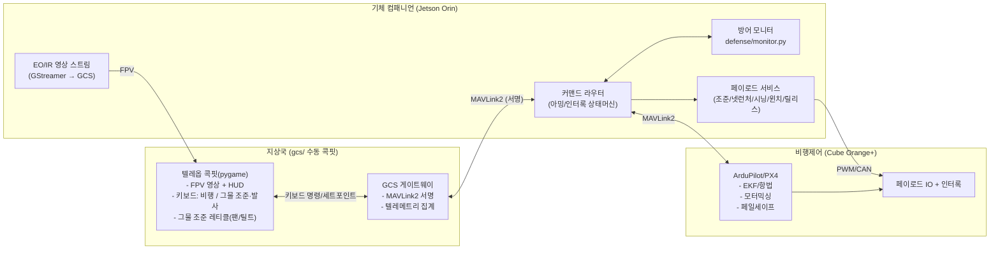
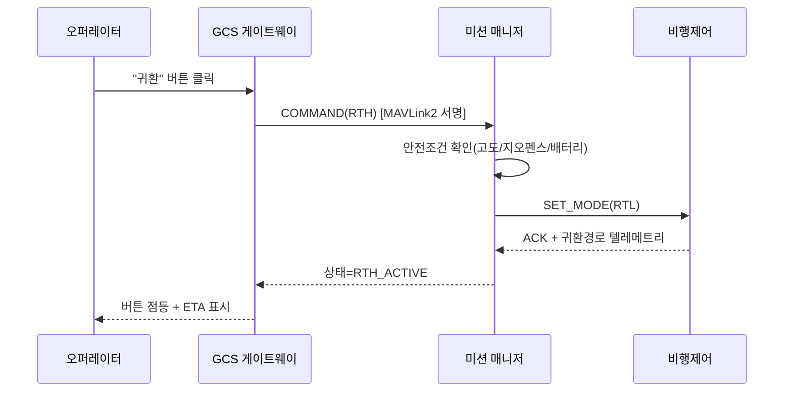
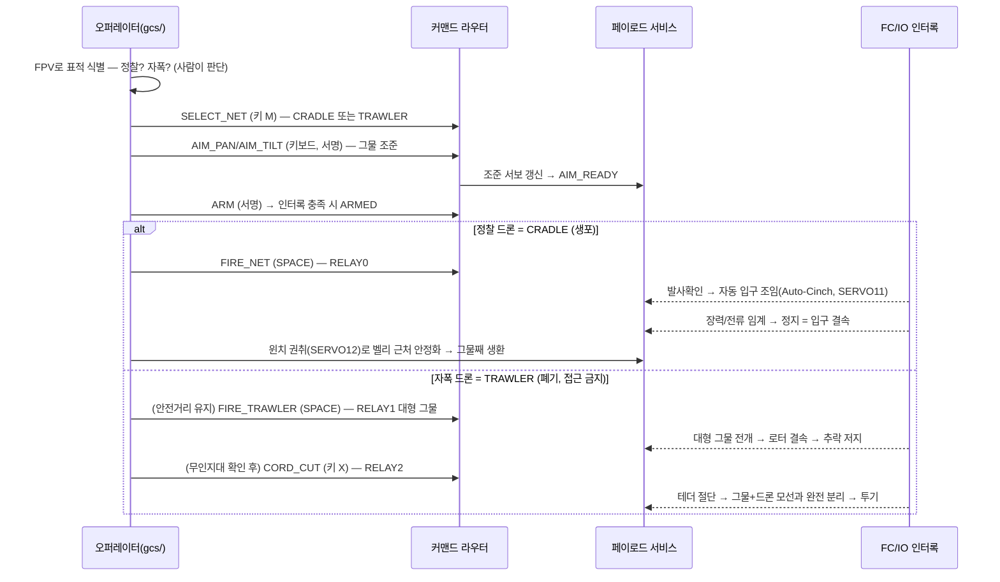
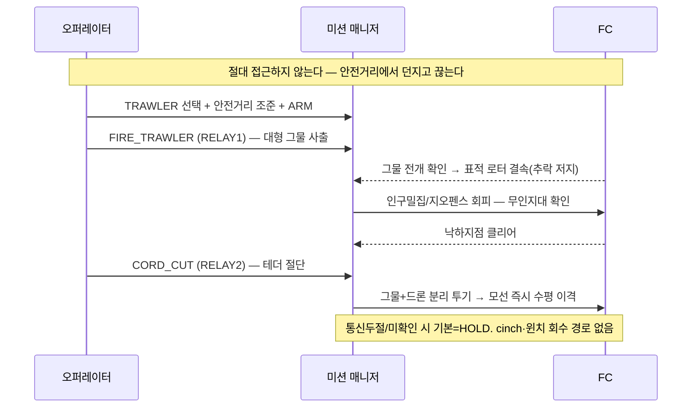

# 🖥️ 07. 소프트웨어 기획 (Hardware-Linked Software)

> **하드웨어 회로와 직접 연동되는 소프트웨어**의 아키텍처/플로우 기획.
> 핵심 컨트롤: **귀환 버튼(RTH)**, **모니터링 버튼/대시보드**, **캡처/투하 명령**, **안전 인터록**.
> ⚠️ 이 문서는 **기획 + 인터페이스 정의**다. 실제 구현 코드는 다음 단계
> (단, 방어 로직 `defense/`는 이미 구현·테스트 완료).

---

## 1. 3계층 소프트웨어 아키텍처

> **⚠️ 변경(2026-06): VLM 자율판단 제거 → 수동 텔레옵.** 속도/책임 이유로 온디바이스
> HawkEye-VLM 자율 결정 루프를 들어냈다. 오퍼레이터가 **FPV 영상 보며 키보드로 직접**
> 비행·그물 조준/발사한다. 구현: [`gcs/`](../gcs/) 수동 조종 콕핏.



- **지상국**: **수동 텔레옵 콕핏**(`gcs/`) — FPV + HUD + 키보드 비행/조준·발사, 모든 상향 명령 **서명**.
- **컴패니언**: 커맨드 라우터(아밍/인터록) + EO/IR 영상 중계 + 방어판정 + 페이로드 제어. **VLM 자율판단 없음**.
- **FC**: 저수준 비행/항법/페일세이프 + 페이로드 IO 인터록(회로 doc 06과 1:1 대응).

---

## 2. 하드웨어 ↔ 소프트웨어 매핑

| SW 컴포넌트 | 연동 하드웨어(doc 06) | 인터페이스 |
|-------------|----------------------|-----------|
| 미션 매니저 | FC | MAVLink2(서명) |
| 페이로드 서비스 | 넷런처 MOSFET/릴레이, **시닝(입구 조임) H-브리지**, 윈치 H-브리지, 퀵릴리스 | FC IO 보드 경유 PWM/CAN |
| 방어 모니터 | GNSS 수신기, C2 라디오 | FC 텔레메트리 + 링크 상태 |
| **그물 조준** | 팬/틸트 조준 서보(AIM-PAN/TILT) | FC IO 보드 경유 PWM(서보) |
| EO/IR 영상 | EO/IR 짐벌 → FPV | GStreamer → GCS 콕핏 |
| **수동 콕핏(`gcs/`)** | 키보드/디스플레이 | GCS 게이트웨이(서명 명령) |

---

## 3. 핵심 컨트롤 & 메시지 플로우

### 3.1 귀환 버튼 (Return-To-Home)

- 서명 안 된 RTH 명령은 FC가 **거부**(`defense/link/mavlink_signing.py`).
- 방어 모니터가 `RETURN_TO_HOME` 권고 시 **자동 RTH** 트리거 가능(오퍼레이터에 통지).

### 3.2 모니터링 / 콕핏 HUD
- 콕핏(`gcs/`)에 고빈도 텔레메트리: 자세/위치/배터리/링크RSSI/**항법신뢰상태**/페이로드 상태.
- **방어 상태 위젯**: OSNMA 인증여부, RAIM 헬스, 스푸핑/재밍 플래그, C2 링크 신뢰 → `defense/monitor.py` 출력 그대로 표시.
- **FPV 영상(EO/IR) + 그물 조준 레티클**(팬/틸트) 오버레이 — 오퍼레이터가 직접 보고 조준. (VLM 자동판정 없음)

### 3.3 캡처 시퀀스 (그물 선택 → 조준 → 발사 → 처분)

> **먼저 표적을 보고 그물을 고른다.** 정찰=🕊️**CRADLE**(생포), 자폭/공격=💥**TRAWLER**(폐기).
> 키 `M`으로 전환, 레티클 색/크기로 현재 탄종 표시. 인터록상 cinch는 CRADLE 전용, cord-cut은
> TRAWLER 전용이라 잘못 누를 수 없다 ([`gcs/control.py`](../gcs/control.py)).


> **CRADLE 2단 결속:** ①발사 → **시닝 모터로 입구 조임**(장력/전류 임계 자동정지) → ②**윈치 권취**.
> 회로 [docs/06 §11.4→§11.5](06_회로_설계.md)와 1:1 대응. 시닝/윈치 전원은 **아밍 릴레이 하류**.
> **TRAWLER는 cinch·윈치 없음** — 잡아오지 않고 끊어 떨군다. 모선-폭탄 물리 연결 시간 = 0초.

### 3.4 TRAWLER 무력화 (Neutralize & Jettison) — 자폭 드론 표준오프 처분


---

## 4. 미션/안전 상태머신

> 비행/추적/조준은 **오퍼레이터 수동**(gcs/). 상태머신은 안전 인터록/페일세이프를 강제한다.

```
IDLE → ARMED → 수동비행 → SELECT_NET(M) → AIM(그물 조준, 수동) → FIRE(수동, 조준+아밍)
   ├─ CRADLE(정찰): FIRE_NET → CINCH(입구 조임) → RECOVER(윈치 권취) → RTH
   └─ TRAWLER(자폭): (안전거리) FIRE_TRAWLER → 로터결속 → 무인지대확인 → CORD_CUT → 투기 → RTH
공통 전이: 어떤 상태에서든
   - 방어판정 DEADRECKON/RTH  → DEGRADED/RTH
   - E-Stop / 링크두절(페일세이프) → FAILSAFE(HOLD→RTL→LAND)
```

---

## 5. 인터페이스 정의 (스펙, 실구현 X)

> 명령 스키마(개념). 모든 상향 명령은 서명되고, 페이로드 명령은 인터록을 통과해야 한다.

> 수동 콕핏(`gcs/`)의 실제 명령/세트포인트 매핑은 [`gcs/control.py`](../gcs/control.py)
> (`ControlState.handle_key`/`setpoint`)에 **구현됨**. 아래는 상위 개념 스키마.

```python
# 기획용 인터페이스 — 실구현은 gcs/control.py 참조
class TeleopCommand(Protocol):
    def setpoint(self, roll, pitch, yaw, throttle) -> Ack: ...  # 수동 비행(키보드)
    def aim_net(self, pan_deg: float, tilt_deg: float) -> Ack: ...  # 그물 조준(서보)
    def select_net(self, mode: str) -> Ack: ...      # "CRADLE" | "TRAWLER" (키 M)
    def fire_net(self) -> Ack: ...                   # CRADLE 발사(RELAY0), 조준+인터록
    def cinch_net(self) -> Ack: ...                  # 입구 조임 모터(CRADLE 전용, 인터록)
    def recover_winch(self) -> Ack: ...              # 상하 권취(CRADLE 회수)
    def fire_trawler(self) -> Ack: ...               # TRAWLER 대형 그물 발사(RELAY1)
    def cord_cut(self) -> Ack: ...                   # TRAWLER 테더 절단/투기(RELAY2, 키 X)
    def safe_drop(self, approval_token: Signed) -> Ack: ...   # CRADLE 비상 투하(별도 아밍)
    def return_to_home(self) -> Ack: ...           # 귀환

class PayloadInterlock(Protocol):
    def is_armed(self) -> bool: ...
    # armed = HW 스위치 AND 비행중 AND 서명된 ARM AND not E-Stop  (doc 06 §5.1)
```

```typescript
// 대시보드 위젯 상태(개념)
interface NavSecurityWidget {
  mode: "TRUST_GNSS" | "GNSS_DEGRADED" | "DEADRECKON" | "RETURN_TO_HOME";
  osnmaAuthenticated: boolean;
  raimHealthy: boolean;
  spoofingSuspected: boolean;
  jammingSuspected: boolean;
  commandLinkTrusted: boolean;
}
```

---

## 6. 기술 스택(제안)
| 계층 | 후보 |
|------|------|
| 컴패니언 미들웨어 | MAVSDK/pymavlink (커맨드 라우터 + 영상 중계) |
| FC 펌웨어 | ArduPilot / PX4 (MAVLink2 서명 활성) |
| **지상국 콕핏** | 본 레포 [`gcs/`](../gcs/) — **pygame 수동 텔레옵**(구현), 키보드 비행+그물 조준/발사 |
| 방어 모듈 | 본 레포 `defense/` (이미 구현, stdlib only) |
| 영상 | GStreamer (EO/IR → GCS 콕핏 FPV) |
| ~~인지(VLM)~~ | **제거됨** — 자율판단 대신 수동 텔레옵(속도/책임) |

---

## 7. 안전 인터록 (소프트웨어 측)
1. **명령 서명 강제**: 미서명 명령 무조건 폐기.
2. **페이로드 2단 아밍**: 발사/투하는 HW 아밍 + SW 아밍 동시.
3. **지오펜스**: 투하/발사 금지구역(인구밀집) 하드 블록.
4. **페일세이프 기본값 = 유지/귀환**: 통신두절 시 절대 자동 발사/투하 금지.
5. **방어판정 연동**: 스푸핑/재밍 의심 시 자동 관성항법/귀환.

---

## 8. 다음 단계
- [ ] ROS2 노드/토픽 설계서 + 메시지 정의(.msg)
- [ ] GCS 대시보드 와이어프레임 → 컴포넌트 구현
- [ ] FC↔컴패니언 MAVLink2 서명 키 프로비저닝 절차
- [ ] HIL(Hardware-in-the-loop) 시뮬레이션으로 인터록 검증

> 한 줄: **버튼은 단순하게, 명령은 서명하고, 페이로드는 인터록으로 잠그고, 의심되면 귀환.**
