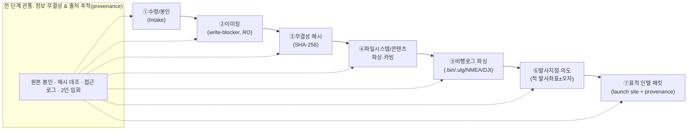
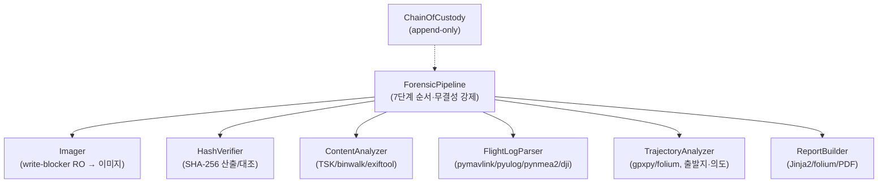

# 🔬 08. 사후 포렌식 — 카운터-UAS 표적정보 추출 (Post-Capture Exploitation)

> 그물로 **비살상·물리적으로 확보한** 적 드론의 저장장치/비행로그를 까서
> **"이 새끼 어디서 쐈냐" = 적 발사지점 좌표**를 뽑는다. 목적은 경찰 신고나 법정 제출이
> ❌ 아니라, **정당방위 반격을 위한 표적정보(target intelligence) 제공**. 적이 **선빵**을
> 악의로 날렸고 우리는 **수비(그물 포획)만** 했다 — 그 출처를 짚어 **비례적·합법적 대응**의
> 근거를 만드는 게 핵심. 실시간 침투·해킹·재밍 아님.
> ⚠️ **이건 정보(intelligence)지 발사명령(fire order)이 아니다.** 모든 교전 결정은
> **인간 지휘관이 ROE·국제인도법(구별·비례·예방) 하에서** 내린다. 민간/민간물자 대상 금지.
> ⚠️ 이 문서는 **파이프라인 + 모듈 아키텍처**를 정의한다. **구현 완료:** `forensics/`
> 어댑터(이미징·해시·콘텐츠·비행로그 파서·항적/의도·PDF 리포트·프린팅)가 **검증된
> 오픈소스(pymavlink·pyulog·pynmea2·gpxpy·folium·fpdf2)** 위에서 동작하며 테스트로 검증됨.
> 이 소프트웨어를 돌리는 **현장 기기**는 `cad/forensic_appliance.scad`(ForensIQ-1) +
> [docs/09](09_Forensic_Appliance_Design.md)·[docs/10](10_Forensic_Appliance_Operator_Guide.md).
> **검증된 오픈소스 파서만** 쓴다 — 뇌피셜 파싱 금지.

---

## TL;DR (바쁜 정보장교님용 3줄)

1. 잡아온 적 드론을 **분해해서 SD카드/eMMC를 뽑는다.** (전원? 안 켬. 통신? 안 함. 그냥 칩만 뽑음.)
2. **읽기전용(write-blocker)** 으로 통째로 복제 → **SHA-256** 도장 쾅 → 원본은 봉인.
3. 복제본에서 **GPS 항적**을 검증된 파서로 캐내서 "**이 새끼 어디서 쐈냐**(=적 발사지점 좌표 ± 오차반경)" 표적 인텔 패킷을 뽑는다.

끝. 적 드론이 **자기 출발지가 적힌 일기장을 들고 잡혀온** 셈. 그걸 읽어서 **지휘관이 정당방위로
반격할 좌표**를 깔끔하게 상납한다. (단, 방아쇠는 **사람**이 ROE/국제인도법 보고 당긴다.)

---

## 0. 왜 이게 정당한가 — 정당방위 표적정보 (먼저 못 박고 간다)

전파 교란을 배제한 물리 포획 + 사후 익스플로잇으로 **공격의 출처를 짚는** 것의 **기술적·윤리적
타당성** (docs/00·05와 동일 입장):

- **선빵은 적이 쳤다 (자위권의 출발점):** 적이 **악의적 목적으로 자폭/정찰 드론을 먼저 날렸다.**
  우리는 그물로 **수비(비살상 포획)만** 했고 먼저 때리지 않았다. 따라서 그 **공격의 근원지를
  특정해 비례적으로 대응**하는 것은 **자위권(self-defence)** 행사 — 경찰 신고할 일이 아니라
  교전 영역의 정당한 **대(對)포(counter-battery)/대UAS 표적식별**이다.
- **현행 교란(Jamming/Spoofing)의 부수피해는 회피:** RF 재밍/GPS 스푸핑은 **민항기·병원
  통신망**까지 오염시키는 무차별 수단 → TaloNet은 신호 조작을 **원천 배제(청정 방어)**.
  공격은 안 하고, **잡아서 읽는다.**
- **비살상 포획 + 오프라인 익스플로잇:** 격추·폭파 없이 **비운동성** 포획 → 2차 피해 제로.
  확보한 하드웨어를 **오프라인으로** 까는 건 실시간 침투('해킹')가 아니라 **확보 자산에 대한
  기술정보 추출(TECHINT/DOMEX)**. 적 발사지점 좌표는 **다음 공격의 인명 피해를 막는** 정보다.
- **선은 분명히 긋는다 (정보 ≠ 발사명령):** 본 시스템은 **표적정보까지만** 산출한다. 발사지점
  좌표엔 **신뢰도 + 오차반경(CEP)** 이 붙고, **교전 여부·수단·시점은 인간 지휘관이 ROE와
  국제인도법(구별·비례·예방)** 하에 결정한다. **민간/민간물자는 표적이 아니다.** 자동 타격 없음.

> 한 줄: **적이 먼저 쐈고(선빵), 우리는 잡아서 "어디서 쐈는지"를 읽어 지휘관에게 넘긴다.
> 방아쇠는 사람이, 법(ROE/LOAC) 안에서 당긴다.**

---

## 1. 스코프 & 위협 모델

| 항목 | 정의 |
|------|------|
| **대상** | 그물로 포획·회수되어 **물리적으로 통제된** 적 드론의 비휘발성 저장장치/로그 |
| **산출물(목표)** | **카운터-UAS 표적 인텔 패킷** — 핵심은 **적 발사지점 좌표 + 오차반경 + 신뢰도**(+ 의도표적·식별자·항적) |
| **포함** | microSD / eMMC / NAND, 비행제어 로그(.bin/.ulg), GNSS 로그(NMEA), EO/IR 미디어, 펌웨어 이미지, 설정파일 |
| **제외(명시적 금지)** | 운용 중 적 시스템 **실시간 침투**, 무선 명령 주입, 키 크래킹을 통한 **타 시스템** 접근, 재밍/스푸핑, **자동 타격** |
| **전원 정책** | 분석 목적의 **부팅 금지**(자폭/와이프 트리거·타이머 회피). 칩은 **오프라인**으로 이미징 |
| **교전 결정** | 본 시스템은 **정보까지만**. 교전 여부·수단·시점은 **인간 지휘관이 ROE/국제인도법** 하에 결정 |
| **정보 무결성** | 모든 단계 **2인 입회 + 해시체인 출처기록**(지휘관이 믿고 쓸 수 있게) |

> ⚠️ **부팅하지 마라.** 적 펌웨어가 "비인가 환경 감지 → 와이프/자폭" 로직을 가질 수 있다.
> 우리는 기기를 **켜는 게 아니라 읽는다.** 저장장치를 분리해 **하드웨어 write-blocker** 뒤에서만 접근.

---

## 2. 분석 파이프라인 (이미징 → 해시 → 파싱 → 발사지점/의도 → 표적 인텔)



**원칙 3줄:**
1. **원본 불가침:** 원본 매체엔 **단 1비트도 쓰지 않는다.** 모든 작업은 **복제본(image)** 위에서.
2. **모든 게 검증가능:** 입수→이미징→분석→리포트가 해시·로그·서명으로 **재현·감사 가능**.
3. **뇌피셜 금지:** 로그 해석은 **검증된 오픈소스 파서**(§5) 출력에 근거. 추정은 **추정이라고 명시**.

---

## 3. 정보 무결성 & 출처 추적 (Provenance / Chain-of-Custody)

> 지휘관이 **이 좌표 믿고 반격해도 되나?** 를 판단하려면 표적정보의 **출처가 위변조
> 불가능하게 추적**돼야 한다. 그래서 모든 단계를 **해시체인 출처기록**으로 남긴다 —
> 법정 제출용이 아니라 **표적정보 신뢰성(intelligence integrity)** 을 위해.

### 3.1 출처 레코드 (필수 필드)
| 필드 | 내용 |
|------|------|
| `evidence_id` | 증거 일련번호(포획 미션 ID·좌표·시각과 링크) |
| `seized_at` / `seized_by` | 포획·확보 시각 / 담당자 |
| `description` | 기체 종류, 저장장치 모델/용량, 외형 상태 사진 |
| `custody_log[]` | (이관시각, from, to, 사유, 서명) — **모든 손바뀜 기록** |
| `acquisition` | 이미징 도구/버전, write-blocker 모델, 시작/종료 시각 |
| `hashes` | 원본·이미지의 SHA-256(+보조 BLAKE2), 매 검증시각마다 재대조 |
| `examiner` / `witness` | 분석관 / 입회자(2인) 서명 |

### 3.2 무결성 검증 흐름
1. **수령 즉시** 외형·봉인 사진 → `evidence_id` 발번 → CoC 개시.
2. **이미징 직후** 원본과 이미지의 SHA-256 **동시 산출 → 일치 확인**(불일치 시 작업 중단·재이미징).
3. **분석은 이미지의 사본(working copy)** 에서만. working copy도 시작/종료 해시 대조.
4. 도구 출력·로그는 **append-only**(수정 불가) 보관. 리포트에 **모든 해시·도구 버전** 첨부.
5. **2인 무결성(two-person integrity):** 이미징·해시·봉인은 입회자 서명과 함께.

> 표준 참조: **NIST SP 800-86**(Guide to Integrating Forensic Techniques into Incident Response),
> **ISO/IEC 27037**(디지털 증거 식별·수집·보존), **ACPO/SWGDE** 디지털 증거 원칙.

---

## 4. 단계별 상세 + 사용할 검증 OSS

### 4.1 ① 수령/봉인 (Intake)
- 기체에서 저장장치를 **물리 분리**(microSD/eMMC/NAND). 부팅 안 함.
- 외형·식별자(시리얼, FCC ID, IMEI, MAC) 기록 → IFF/귀속 단서.

### 4.2 ② 이미징 (Imaging) — 읽기전용 원본 보존
- **하드웨어 write-blocker**(Tableau / WiebeTech) 또는 소프트웨어 RO 마운트
  (`blockdev --setro`, `mount -o ro,noload`) 전제. eMMC/NAND는 칩-오프/리더 사용.
- 비트 단위 이미지 덤프(+산출 즉시 해시):
  - **dc3dd** / **dcfldd** — 해시 산출 내장 포렌식 dd (DCCI / DoD).
  - **ewfacquire**(libewf) — EnCase **E01**(압축·메타·해시 내장) 컨테이너.
  - **Guymager** — GUI 이미저(검증 해시 포함).
- 산출물: `raw(.dd)` 또는 `E01` + `.sha256` + 취득 로그.

### 4.3 ③ 무결성 해시 (Integrity)
- **sha256sum** / **hashdeep**(md5deep 제품군) — 재귀 해시 + **감사 모드**(audit)로 사후 대조.
- 원본·이미지·working copy **3중 해시 일치** 확인.

### 4.4 ④ 파일시스템 / 콘텐츠 분석
- **The Sleuth Kit (TSK)** + **pytsk3** — 파티션/파일시스템 파싱, 삭제파일 복구, 타임라인.
- **plaso / log2timeline** — 슈퍼 타임라인(파일·로그 이벤트 통합 시계열).
- **PhotoRec / foremost** — 시그니처 기반 파일 카빙(포맷 손상/삭제분 복구).
- **binwalk** — 펌웨어 이미지 추출·엔트로피 분석(부트로더/루트FS 식별).
- **ExifTool**(+ pyexiftool) / **Hachoir** — 미디어·바이너리 **메타데이터**(촬영시각·GPS태그·기기모델·렌즈).
- **YARA** — 알려진 펌웨어/멀웨어/페이로드 시그니처 매칭(IFF·귀속 보조).

### 4.5 ⑤ 비행로그 파싱 (포맷별 — 전부 검증 OSS)
> **흔한 로그 포맷을 검증된 파서로** 읽는다. 자체 파서 구현 금지.

| 포맷 | 출처 기기 | 검증 파서 |
|------|-----------|-----------|
| **ArduPilot `.bin` (DataFlash)** | Pixhawk/ArduPilot 계열 | **pymavlink** (`DFReader`, `mavmemlog`) / `MAVExplorer` |
| **PX4 `.ulg` (ULog)** | PX4 계열 | **pyulog** / PX4 **Flight Review** |
| **MAVLink tlog `.tlog`** | 텔레메트리 캡처 | **pymavlink** (`mavutil`) |
| **NMEA 0183** | 범용 GNSS 수신기 | **pynmea2** |
| **DJI `.txt`/`.DAT` 비행기록** | DJI 계열 | **dji-log-parser**(암호화 txt, DJI API 키 필요) · DatCon/CsvView(참조) |
| **GPX/KML 교환** | 변환·내보내기 | **gpxpy** / **gpsbabel**(포맷 변환) |

- 추출 항목: 시계열 **위치(lat/lon/alt)**, 속도/자세, **홈/이륙 좌표**, 웨이포인트/미션 아이템,
  배터리, RC 입력, 모드 전이, 타임스탬프(UTC).

### 4.6 ⑥ 발사지점 지오로케이션 · 의도 분석 (핵심 산출물)
> SD카드는 **금광**이다 — 좌표 하나로 끝내지 않고, 로그가 담은 걸 전부 캐낸다.
- **항적 재구성:** 로그 GPS → **gpxpy** 트랙 → **folium**(Leaflet/OSM) 지도화(HTML).
- **★ 적 발사지점(HOSTILE LAUNCH SITE):** 홈/오리진 / 첫 측위 / 항적 역추적 →
  **발사 좌표 + 오차반경(CEP) + 신뢰도**. 반격 표적의 핵심 좌표. (`launch_estimate`+`launch_radius_m`)
- **적 기지(레인지 링):** **작전반경**(발사점↔최원거리) + 배터리 용량/순항속도 → **기지가
  존재할 거리 링**. **다중 출격** 출발지가 한곳에 모이면 → **반복 출발지=고정 발사진지**. (`operating_radius_m`,`launch_sites`,`recurring_origin`)
- **계획 항로(다음 표적):** 로그의 **미션 아이템(웨이포인트/loiter)** 추출 → 적이 짠 **이동
  경로·추가 표적**. (`mission_plan` ← pymavlink `CMD`/`MISSION_ITEM_INT`)
- **귀속(Attribution):** **펌웨어 배너/버전·git 해시·보드 ID** → 어느 빌드/세력 표준설정인지. (`firmware`)
- **파라미터 인텔:** **지오펜스(적 AO 경계)·페일세이프/RTL·무전 SYSID(운용자/GCS)·기체클래스·
  순항속도** 등 관심 파라미터만 큐레이션. (`parameters_of_interest`)
- **정찰 영상 지오태그:** 미디어 EXIF GPS → **적이 뭘 촬영했나**(ISR 표적) + 카메라 기종(귀속). (`imaged_locations`)
- **타임라인:** 첫/마지막 측위 UTC·출격 횟수 → **공격 시간대 패턴**. (`timeline`)
- **의도 표적(아군 자산):** 체공(loiter ≥3샘플)·하강 패턴 → 적이 **노린 대상** 추정.
- **공간 분석(옵션):** **GDAL/Shapely** POI/금지구역 교차, **scikit-learn** 반복패턴 군집.
  **모든 추정엔 신뢰도/오차반경/근거 첨부**(단정 금지).

### 4.7 ⑦ 표적 인텔 패킷 산출 (Counter-UAS Target Intel)
- **표적 인텔 리포트:** ① **적 발사지점 좌표 ± 오차반경 + 신뢰도**(맨 위), ② 의도 표적,
  ③ 항적/패턴오브라이프, ④ 식별자(IFF/귀속), ⑤ 페이로드/미디어 메타. → 지휘관 표적 결심·아군
  방어 갱신·차기 위협 예측에 환류. (구현: `forensics/adapters/report.py` PDF + 열전사 텍스트.)
- **출처(provenance) 로그 동봉:** 모든 해시·도구 버전·단계 기록을 **불변 첨부** → 표적정보 신뢰성.
- **⚠️ 표기 의무:** 리포트 전면에 **"정보 산출물, 발사명령 아님 / 교전은 인간이 ROE·LOAC 하에
  결정 / 독립 수단으로 발사지점 교차검증 / 민간 대상 금지"** 카비앗을 박는다(코드에 하드코딩됨).

---

## 5. 검증 OSS 목록 (실제 존재 — 라이선스/출처 명시)

> 전부 **실존·검증된** 오픈소스/표준 도구. 자체(뇌피셜) 파서·크립토 구현 안 함.

| 도구 / 라이브러리 | 용도 | 라이선스 | 출처 |
|------------------|------|----------|------|
| **pymavlink** | ArduPilot `.bin`/`.tlog` 파싱 (`DFReader`) | LGPL-3.0 | github.com/ArduPilot/pymavlink |
| **pyulog** | PX4 `.ulg`(ULog) 파싱 | BSD-3-Clause | github.com/PX4/pyulog |
| **PX4 Flight Review** | ULog 시각화/분석 | BSD-3-Clause | github.com/PX4/flight_review |
| **pynmea2** | NMEA 0183 GNSS 문장 파싱 | MIT | github.com/Knio/pynmea2 |
| **dji-log-parser** | DJI 암호화 비행기록 파싱 | MIT | github.com/lvauvillier/dji-log-parser |
| **gpxpy** | GPX 트랙 파싱/생성 | Apache-2.0 | github.com/tkrajina/gpxpy |
| **GPSBabel** | GPS 포맷 상호변환 | GPL-2.0 | github.com/gpsbabel/gpsbabel |
| **folium** | Leaflet/OSM 지도 시각화 | MIT | github.com/python-visualization/folium |
| **The Sleuth Kit (TSK)** | 파일시스템 포렌식 | CPL/IPL/GPL | github.com/sleuthkit/sleuthkit |
| **pytsk3** | TSK 파이썬 바인딩 | Apache-2.0 | github.com/py4n6/pytsk |
| **plaso / log2timeline** | 슈퍼 타임라인 | Apache-2.0 | github.com/log2timeline/plaso |
| **PhotoRec / TestDisk** | 파일 카빙·복구 | GPL-2.0+ | github.com/cgsecurity/testdisk |
| **foremost** | 시그니처 파일 카빙 | 공공도메인(US Gov) | github.com/korczis/foremost |
| **binwalk** | 펌웨어 추출·분석 | MIT | github.com/ReFirmLabs/binwalk |
| **ExifTool** | 미디어/바이너리 메타데이터 | Perl(Artistic/GPL) | exiftool.org |
| **Hachoir** | 바이너리 메타데이터 파싱 | GPL-2.0 | github.com/vstinner/hachoir |
| **YARA** | 시그니처 매칭(귀속/IFF) | BSD-3-Clause | github.com/VirusTotal/yara |
| **dc3dd / dcfldd** | 해시 내장 포렌식 이미징 | GPL-2.0+ | sourceforge.net/projects/dc3dd |
| **libewf (ewfacquire)** | E01 증거 컨테이너 | LGPL-3.0 | github.com/libyal/libewf |
| **Guymager** | GUI 디스크 이미저 | GPL-2.0 | guymager.sourceforge.io |
| **hashdeep/md5deep** | 재귀 해시 + 감사 | 공공도메인(US Gov) | github.com/jessek/hashdeep |
| **GDAL / Shapely** | 지리공간 분석 | MIT / BSD | gdal.org · github.com/shapely/shapely |
| **Jinja2 / WeasyPrint** | 리포트 템플릿/PDF | BSD / BSD | palletsprojects.com · weasyprint.org |

표준/지침(비도구): **NIST SP 800-86**, **ISO/IEC 27037**, **SWGDE/ACPO** 디지털 증거 원칙.

---

## 6. 모듈 아키텍처 (`forensics/`) — **구현 완료**

```
forensics/
├── README.md             # 패키지 개요 + 검증 OSS 출처
├── __init__.py
├── interfaces.py         # 단계별 Protocol + dataclass (증거/해시/항적/리포트)
├── geo.py                # 항적 수학(하버사인/방위/체공감지) — 무의존
├── chain_of_custody.py   # CoC: append-only 해시체인(변조 탐지) 로그 [동작]
├── pipeline.py           # 7단계 오케스트레이션 + 무결성 게이트 [동작]
├── printing.py           # 내장 프린터 싱크(텍스트/ESC-POS 열전사/CUPS-PDF)
├── appliance.py          # 고수준 기기 워크플로(카드 삽입→분석→인쇄→증거USB)
└── adapters/             # 검증 OSS 어댑터(전부 동작, 무거운 import는 지연)
    ├── imaging.py        # DiskImager: write-block RO 비트복사 + SHA-256(+dc3dd)
    ├── hashing.py        # Sha256Verifier (stdlib)
    ├── content.py        # 파일 인벤토리/해시/로그탐지/식별자(+ExifTool)
    ├── flightlog.py      # pymavlink(.bin/.tlog)·pyulog(.ulg)·pynmea2·dji + 라우터
    ├── trajectory.py     # 출발지/타깃 추정 + folium 지도
    └── report.py         # PdfReportBuilder(fpdf2) + 열전사용 텍스트 포맷터
```

- 각 단계는 **Protocol**(인터페이스) 구현 → 어댑터는 **검증 OSS 래퍼**로 교체 가능.
- `ForensicPipeline`이 **단계 순서·무결성 게이트**를 강제: 해시 불일치 → `IntegrityError`로
  **중단**(리포트 미생성). 매 단계 **CoC 해시체인**에 기록.
- 무거운 서드파티 라이브러리는 메서드 내부에서 **지연 import** → `import forensics`는
  **의존성 0**으로도 동작(임베디드/에어갭 친화). 핵심 로직만 얇고 감사 가능하게.
- 테스트: `tests/test_forensics_*.py` — geo/imaging/hashing/CoC/pipeline는 **무의존 상시
  실행**, 파서/PDF 테스트는 라이브러리 있을 때 실행(`skipUnless`).



- 각 단계는 **Protocol**(인터페이스)로 정의 → 구현체는 **검증 OSS 어댑터**로 교체 가능
  (예: `Imager` = dc3dd 어댑터, `FlightLogParser` = pymavlink/pyulog 어댑터).
- `ForensicPipeline`이 **단계 순서·무결성 게이트**를 강제: 해시 불일치/원본 쓰기 시도 → **중단**.
- `defense/`와 동일 철학: **검증된 외부 구현에 위임**, 핵심 로직만 감사 가능하게 얇게.

> 구현체는 [`forensics/`](../forensics/) 참조. `forensics.ForensicAppliance.process_card()`
> 한 번 호출로 **카드 삽입 → 이미징·해시 → 파싱 → 항적/의도 → PDF 리포트 → 내장 프린터
> 인쇄 + 증거 USB 아카이브 → 봉인**까지 수행한다.

---

## 7. 안전 · 한계 (정직하게)

- **반자동(human-in-the-loop):** 의도/타깃/출발지 추정은 **분석관 검토 필수**. 도구는 단서를 줄 뿐.
- **불확실성 명시:** GPS 멀티패스·로그 손상·시각 오차 존재 → 추정엔 **신뢰도·근거** 항상 첨부.
- **암호화/독점 포맷:** 일부 DJI 신형 로그는 **DJI API 키** 필요(dji-log-parser), 풀 NAND는
  칩-오프·ECC 처리 필요할 수 있음 — **가능 범위를 리포트에 명시**.
- **부팅 금지 원칙:** 적 펌웨어 안티포렌식(와이프/자폭 타이머) 회피 위해 **오프라인 이미징만**.
- **법적 범위 준수:** 본 절차는 **확보된 압류 물품**에 한함. 타 시스템 접근·실시간 침투는 **범위 밖(금지)**.

---

## 8. 상태 & 다음 단계
- [x] 검증 OSS 어댑터 구현(pymavlink/pyulog/pynmea2/gpxpy/folium/fpdf2) + 테스트.
- [x] `chain_of_custody.py` append-only **해시체인**(변조 탐지) — 구현·테스트 완료.
- [x] 항적 → folium 지도 + **fpdf2 PDF 리포트** + 열전사 텍스트 리포트.
- [x] 합성 NMEA/`.tlog` 골든 케이스 파서 테스트(`tests/test_forensics_*`).
- [x] 현장 기기 ForensIQ-1 설계(SCAD/설계서/운용가이드, docs/09·10).
- [ ] DJI 신형 암호화 로그(`dji-log-parser` + DJI API 키) 통합 + The Sleuth Kit 라우 이미지 추출.
- [ ] 실제 압류 `.bin`/`.ulg` 샘플 회귀 코퍼스 + CoC 서명(공개키) 검증.
- [ ] CoC/무결성 절차 표준(NIST SP 800-86 / ISO 27037) 체크리스트 매핑.

> 한 줄: **원본은 봉인하고, 복제본만 만지고, 검증된 파서로만 읽고, 추정은 추정이라고 적는다.**
