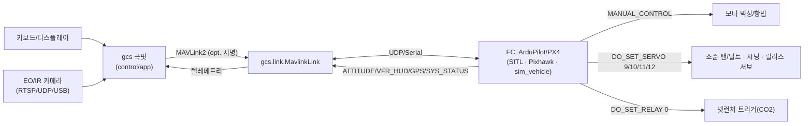

# 11. CONOPS & 배포 — 작동하는 프로토타입

> TaloNet을 **실제 군 고객이 어떻게 쓰는가**(CONOPS)와, 그 흐름대로 **바로 돌릴 수 있는
> 프로토타입**(목업 아님, 실 MAVLink·실 서보·실 텔레메트리)을 어떻게 띄우는지.
> 소프트웨어(`gcs/`)와 하드웨어(`cad/`, `docs/06`)는 **단일 진실원천**
> [`gcs/payload_map.py`](../gcs/payload_map.py)로 서로 일치한다.

---

## 1. 운용 개념 (CONOPS) — 오퍼레이터의 하루

> 전방 대드론 진지. 오퍼레이터 1명(조종) + 입회자 1명(무결성). VLM 없음 — **사람이 본다.**

1. **전원/링크 점검.** 모선 시동 → 노트북 콕핏 `python -m gcs --connect ...`. HUD 좌상단
   **`LINK: MAVLINK`** 녹색, 배터리·GPS(위성수)·자세 라이브. (링크 없으면 자동 오프라인 모드)
2. **순찰(PATROL).** `WASD`/`QE`/`RF`로 수동 비행. EO/IR FPV가 화면 가득, 헤딩/속도/고도 테이프.
3. **탐지(DETECT).** 적 FPV 진입 → EO 트래커가 **빨간 `HOSTILE UAS` 박스**(RNG/BRG) 그림.
   오퍼레이터가 **육안으로 적/아군/위험도 판단**(교전 결정은 사람).
4. **접근 + 조준(AIM).** 모선을 적 상방으로 몰고, `IJKL`로 **그물 머즐을 슬루** →
   서보가 실제로 돌고(HUD 녹색 NET 레티클이 적 박스에 겹침), `net_pan/tilt`가 FC `DO_SET_SERVO`로 전달.
5. **무장(ARM).** `G` → 상태바 **`ARMED`**(빨강). (E-Stop `B`는 언제든 즉시 안전화)
6. **발사(FIRE).** 사정권에서 **`SPACE`** → 트리거 릴레이 ON, CO2 사출, **그물 발사·전개**.
7. **결속(CINCH).** `C` → 입구 조임 모터로 mouth 졸라 결속(이탈 방지).
8. **처리(DISPOSITION) — 사람이 결정.**
   - 양품 의심 → `H` 부근 안정화 후 윈치 회수 → 기지 복귀.
   - 자폭형 의심 → `V`로 무인지대 **안전 투하**(별도 승인).
9. **귀환(RTL).** `H` → FC `NAV_RETURN_TO_LAUNCH`.
10. **사후 익스플로잇.** 회수한 적 드론 SD → **ForensIQ-1**([docs/09](09_Forensic_Appliance_Design.md))에
    꽂으면 → **적 발사지점 좌표·기지 레인지링·계획항로·펌웨어 귀속**이 열전사로 출력
    ([docs/08](08_사후_포렌식.md)). 지휘관 표적 결심 인텔로 환류. (정보까지만, 교전은 인간이 ROE/LOAC 하에)

---

## 2. 시스템 데이터 흐름 (실배선)



채널·PWM·각도리밋은 **한 곳**에서 정의되고(`gcs/payload_map.py`) 콕핏이 그 채널로 정확히
`DO_SET_SERVO`를 보낸다. 같은 숫자가 `cad/talonet_frame.scad`(net_pan/tilt 리밋)과
`docs/06`(AIM-PAN/TILT 핀맵)에 반영된다.

| 기능 | 채널/릴레이 | 각도→PWM | 비행펌웨어 설정 |
|------|------------|----------|----------------|
| AIM-PAN | SERVO **9** | −60..+60° → 1000..2000µs | `SERVO9_FUNCTION=1`(RCPassThru) 또는 스크립트 |
| AIM-TILT | SERVO **10** | 0..75° → 1000..2000µs | `SERVO10_FUNCTION=...` |
| CINCH | SERVO **11** | 0..100% → 1000..2000µs | 모터 드라이버 PWM |
| RELEASE | SERVO **12** | 0..1 → 1000..2000µs | 래칭 서보/솔레노이드 |
| NET FIRE | RELAY **0** | `DO_SET_RELAY` | `RELAY1_FUNCTION=1` |

> 단일 진실원천: 리밋을 바꾸려면 `payload_map.py` 한 줄만 고치면 콕핏·짐벌 범위·문서가 같이 따라온다.

---

## 3. 배포 — 바로 돌리는 프로토타입

```bash
pip install -r requirements-gcs.txt          # pygame, numpy, pymavlink
```

### A. 하드웨어 없이 풀루프 (실 MAVLink, 시뮬 차량)
```bash
# 터미널 1: 차량 에뮬레이터(실 MAVLink2 프레임)
python -m gcs.sim_vehicle --connect udpin:127.0.0.1:14550
# 터미널 2: 콕핏 — 실제로 ARM/조준/발사 명령이 차량으로 전송되고 텔레메트리가 HUD에 뜸
python -m gcs --connect udpout:127.0.0.1:14550
```

### B. ArduPilot SITL
```bash
sim_vehicle.py -v ArduCopter --out=udp:127.0.0.1:14550   # ArduPilot SITL
python -m gcs --connect udpout:127.0.0.1:14550
```
SITL에서 `SERVO9/10/11`, `RELAY1` 출력을 `param set`으로 잡으면 발사·조준이 SITL 로그에 보인다.

### C. 실 비행컨트롤러 + EO 카메라
```bash
# Pixhawk USB
python -m gcs --connect /dev/ttyACM0 --video rtsp://10.0.0.5:8554/eo
# 또는 텔레메트리 라디오/UDP
python -m gcs --connect udpout:10.0.0.5:14550 --video 0   # 0 = 로컬 캡처카드
```
- 그물 짐벌 서보를 FC AUX(SERVO9/10)에 결선 → `payload_map.py`의 채널/PWM과 일치하게
  `SERVOn_MIN/MAX/TRIM` 캘리브레이션.
- 넷런처 트리거를 RELAY1에 결선(`RELAY1_FUNCTION=1`).
- **MAVLink2 서명(옵션):** 운용 시 FC와 콕핏에 동일 키 프로비저닝 후
  `MavlinkLink(connect, key=b"...")` (SITL/sim은 무서명이 기본).

---

## 4. 운용 안전 인터록 (소프트·하드 동시)
- **2단 아밍:** 콕핏 `ARMED` + FC 측 HW 아밍/인터록(`docs/06 §11`) 동시 필요. 발사/조임/투하는 ARMED에서만.
- **E-Stop:** `B` 즉시 무장해제(throttle 0, 릴레이 차단). `N`으로만 해제.
- **조준 후 발사:** FIRE는 `AIM_READY ∧ ARMED ∧ FIRE_WINDOW`.
- **페일세이프:** 링크두절 시 FC 기본 HOLD→RTL→LAND. 자동 발사/투하 절대 금지.
- **정보-인-더-루프:** 시스템은 조종/조준만 — **교전 판단은 사람이 ROE/LOAC 하에**, 민간 비표적.

---

## 5. 한계 & 다음
- `sim_vehicle`는 **프로토콜/텔레메트리 스탠드인**(비행역학 아님). 실 비행은 FC + HIL/SITL로.
- 실 짐벌은 서보 캘리브레이션(`SERVOn_*`)과 기계 리밋을 `payload_map`과 일치시켜야 함.
- 다음: FC 측 Lua 스크립트로 조준/발사 인터록 강제, EO 트래커(실측 BRG/RNG) 연동, 비행시험.

> 한 줄: **`payload_map.py` 하나로 SW·HW가 일치하고, `--connect` 하나로 SITL→실 Pixhawk까지
> 같은 코드가 그대로 돈다.**
