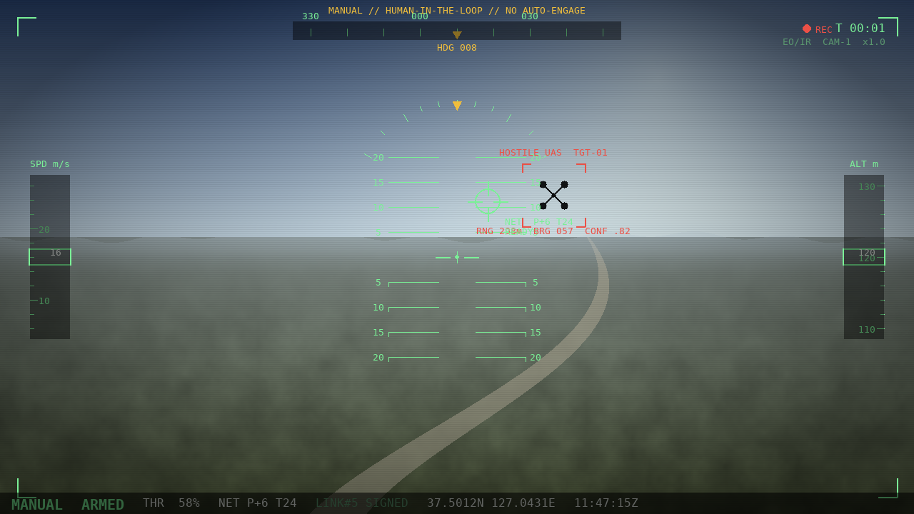

# `gcs/` — TaloNet manual teleop cockpit

> **Speed first, human in the loop, no VLM.** A ground-control app you install on a
> laptop: a realistic **EO/IR FPV feed** fills the screen under a **professional
> military HUD** (boresight + pitch ladder, bank arc, heading/speed/altitude tapes,
> a HOSTILE-UAS target box, and the green NET-AIM reticle), and you fly the
> mothership **and** aim/fire the software-aimed net from the keyboard. Onboard VLM
> autonomy was dropped — a human reacts faster than a 2-second inference, and the
> engagement decision stays with the operator.



## Run

```bash
pip install -r requirements-gcs.txt
python -m gcs                      # launches the cockpit window
```

Headless smoke (no display):

```bash
SDL_VIDEODRIVER=dummy python -c "from gcs.app import run; run(max_frames=1, screenshot='cockpit.png')"
```

## Controls

| Keys | Action |
|------|--------|
| `W`/`S` `A`/`D` | pitch / roll |
| `Q`/`E` | yaw |
| `R`/`F` | throttle up / down |
| `I`/`K` `J`/`L` | net aim tilt / pan (slews the green reticle) |
| `SPACE` | **fire net** (armed only, in the aimed direction) |
| `C` | cinch (purse the mouth shut) |
| `V` | release / drop |
| `G` | arm toggle · `B` E-STOP · `N` reset · `H` return-to-home · `ESC` quit |

Interlocks mirror the hardware (docs/06 §11): FIRE/CINCH/RELEASE require **ARMED**,
nothing arms while **E-STOP** is latched.

## Architecture

| Module | Role | Deps |
|--------|------|------|
| `control.py` | `ControlState` + key mapping → setpoints & command events | stdlib |
| `link.py` | `LoopbackLink` — sequenced, HMAC-signed, anti-replay command link | stdlib |
| `camera.py` | `SyntheticCamera` (procedural FPV) + optional `OpenCVCamera` | numpy / opencv |
| `app.py` | pygame cockpit: FPV pane + HUD + net-aim reticle (`run()`) | pygame, numpy |

The control core is dependency-free and unit-tested (`tests/test_gcs.py`); `pygame`
is imported lazily so importing `gcs` works without a display.

The real command link uses **MAVLink 2 message signing** (the cockpit's
`LoopbackLink` HMAC is the same idea, stubbed) — see
[`defense/link/mavlink_signing.py`](../defense/link/mavlink_signing.py) and
[`defense/link/rf_link_security.py`](../defense/link/rf_link_security.py). Net aim
maps to the `net_pan`/`net_tilt` gimbal in
[`cad/talonet_frame.scad`](../cad/talonet_frame.scad) and the AIM-PAN/AIM-TILT
servo channels in [`docs/06`](../docs/06_회로_설계.md).
